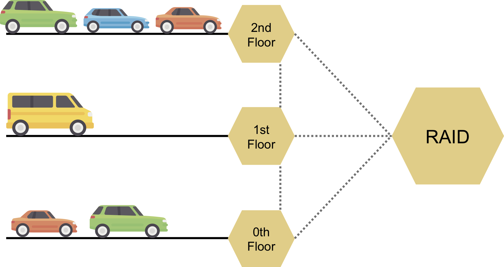

# FBase Example

This project is part of the FBase research project which includes the following subprojects:
* [FBase](https://github.com/OpenFogStack/FBase): Main repository with the FBase system
* [FBaseNamingService](https://github.com/OpenFogStack/FBaseNamingService): The FBase Naming Service
* [FBaseCommons](https://github.com/OpenFogStack/FBaseCommons): Common utility classes used by FBase and the FBase Naming Service
* [FBaseExample](https://github.com/OpenFogStack/FBaseExample): Example FBase setup that uses Vagrant and VirtualBox

The combination of edge and cloud in the fog computing paradigm enables a new breed of data-intensive applications. These applications, however, have to face a number of fog-specific challenges which developers have to repetitively address for every single application.
FBase is a replication service specifically tailored to the needs of data-intensive fog applications that aims to ease or eliminate challenges caused by the highly distributed and heterogeneous environment fog applications operate in.

If you use this software in a publication, please cite it as:

### Text
Jonathan Hasenburg, Martin Grambow, David Bermbach. **Towards A Replication Service for Data-Intensive Fog Applications**. In: Proceedings of the 35th ACM Symposium on Applied Computing, Posters Track (SAC 2020). ACM 2020.

Jonathan Hasenburg, Martin Grambow, David Bermbach. **FBase: A Replication Service for Data-Intensive Fog Applications**. In: Technical Report MCC.2019.1. TU Berlin & ECDF, Mobile Cloud Computing Research Group. 2018.

### BibTeX
```
@inproceedings{paper_hasenburg_towards_fbase,
	title = {{Towards A Replication Service for Data-Intensive Fog Applications}},
	booktitle = {Proceedings of the 35th ACM Symposium on Applied Computing, Posters Track (SAC 2020)},
	publisher = {ACM},
	author = {Jonathan Hasenburg and Martin Grambow and David Bermbach},
	year = {2020}
}

@inproceedings{paper_hasenburg_towards_fbase,
	title = {{Towards A Replication Service for Data-Intensive Fog Applications}},
	booktitle = {Proceedings of the 35th ACM Symposium on Applied Computing, Posters Track (SAC 2020)},
	publisher = {ACM},
	author = {Jonathan Hasenburg and Martin Grambow and David Bermbach},
	year = {2020}
}
```

A full list of our [publications](https://www.mcc.tu-berlin.de/menue/forschung/publikationen/parameter/en/) and [prototypes](https://www.mcc.tu-berlin.de/menue/forschung/prototypes/parameter/en/) is available on our group website.

## Instructions

This example depicts a working FBase setup. It is based on the *Smart Parking Garage Management* scenario of the *Design and Implementation of a Fog Data Management System* Master's thesis from Jonathan Hasenburg.

### Scenario description (as written in the thesis):
*"The owner of a parking garage wants to deploy an application that automatically gives recommendations to visitors about the floor to be used. However, he does not want to install sensors on each parking spot due to a tight budget. Instead, a system that counts the number of cars that enter/exit a floor is capable of reaching the required accuracy while being a lot cheaper. For such a system, a sensor needs to be deployed at each car entrance and exit of a floor. In addition, there needs to be a display to visualize the capacity of this floor, and the capacity of all other floors. System wise, this requires an independent machine on each floor if received sensor input is supposed to be processed immediately.

The machines distribute their floor’s capacity to all other machines of the same parking garage. It is very important for the owner that no single point of failure exists, so the crash of a single machine on one floor should not stop the other machines from working. Furthermore, all data is permanently stored on a RAID inside the parking garage because the machines on each floor only have a limited storage capacity. With the permanently stored data, the parking garage owner can answer various questions, e.g., whether the garage has capacity problems in certain times of the year."*



All in all, the parking garage has three floors, as visualized above. Each floor node puts its own data into its own keygroup, in which the other floor nodes and the RAID node are listed as trigger nodes. Every datum emitted by a node simply contains the number of cars currently positioned on the belonging floor.

### Usage

Requires:
* VirtualBox
* Vagrant

1. Before startup, clear logs and remove naming service data folder.
1. Run `vagrant up` to startup the naming service, the raid node and all the floor nodes (floor0 through floor2). Note, that vagrant up will pull on the first startup the latest source code from GitHub and build a new jar.
  * The raid node vm will also compile the FBaseExampleClients jars on first startup.
  * The raid vm will use Registration.jar to register the other floor nodes at the naming service.
1. Create the keygroups (`vagrant provision raid --provision-with run_client_keygroupBootstrap`), make sure that it worked, otherwise run again.
1. Tell every floor node to update its local keygroup config for each keygroup created (because otherwise they do not know about them, note: raid knows because of above already about keygroups): `vagrant provision floor0 --provision-with run_client_keygroupUpdateSubscriptions` (also for floor0, floor1, floor2)
1. Start generation of records for floor nodes: `vagrant provision floor0 --provision-with run_client_addRecords` (also for floor0, floor1, floor2)

You can re-provision (re-run one the scripts defined in Vagrantfile with vagrant provision, e.g., `vagrant provision raid --provision-with run_client_registration`).

It is possible to kill a node (e.g., `vagrant halt floor0`) and start it up afterwards again. Do not forget to tell the node to update its local keygroups with the provisioner.
